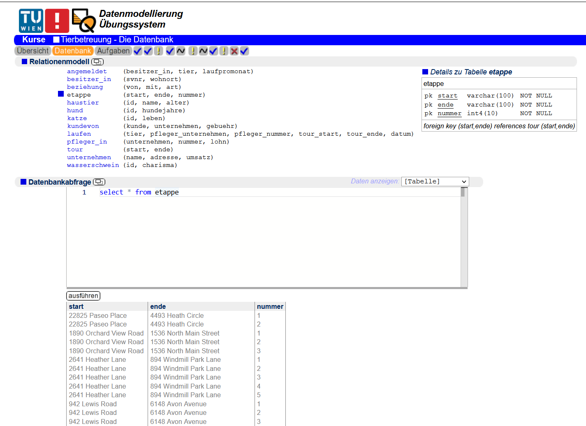

# dbs-editor
Putting the editor of the TU Vienna databases website on steroids. This has been integrated into the official DBS course website, yay.

**Install it**
1. Firefox: [Violentmonkey](https://addons.mozilla.org/en-US/firefox/addon/violentmonkey/)  
Chrome: [Violentmonkey](https://chrome.google.com/webstore/detail/violentmonkey/jinjaccalgkegednnccohejagnlnfdag)
2. [Install the script](https://github.com/stefnotch/dbs-editor/raw/main/script.user.js)

## Screenshot 

